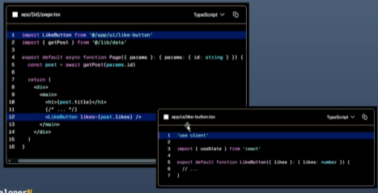
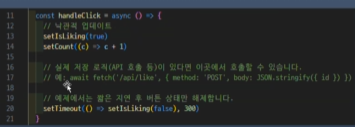
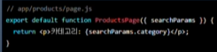
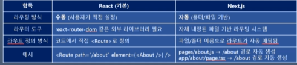
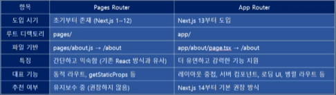

# react-2

# 202130414 심민우

## 10월 17일(7주차)

### server 및 client component를 언제 사용해야 하나요?

- client 환경과 server 환경은 서로 다른 기능을 가지고 있습니다.

- server 및 client component를 사용하면 사용하는 사례에 따라 각각의 환경에서 필요한 로직을 실행할 수 있습니다.
- 다음과 같은 항목이 필요할 경우에는 client component를 사용합니다.

  - state 및 event handler, 예: onclick,onChange
  - Lifecycle logic.예 useEffect.
  - 브라우저 전용 API 예 localStorage, window, Navigator,getLocation 등
  - 사용자 정의 Hook

- 다음과 같은 항목의 경우는 server component

  - 서버의 데이터베이스 혹은 API에서 data를 가져오는 경우
  - API key, token 및 기타 보안데이터를 client에 노출하지 않고 사용.
  - 브라우저로 전송되는 javascript의 양을 줄이고 싶을 때 사용.
  - 콘텐츠가 포함된 첫 번째 페인트를 개선하고 콘텐츠를 client에 점진적으로 스트리밍.

- 예를 들어, `<Page>` component는 게시물에 대한 데이터를 가져와서, client 측 상호작용을 처리하는 `<LikeButton>` 에 props로 전달하는 server component 입니다.
- 그리고, @/ui/like-button 은 client component이기 때문에 use client를 사용하고 있습니다.



### Optimistic Update(낙관적 업데이트)

- 사용자의 입력이나 이벤트(예: 좋아요 버튼 클릭)가 발생하면,
  서버 응답을 기다리지 않고 클라이언트(브라우저) 의 UI를 즉시 변경(업데이트)합니다.

- 서버에 보낸 요청의 성공을 낙관(optimistic) 하고 가정해서
  먼저 화면에 변화를 보여줍니다.
- 서버에서 응답이 없으면, UI를 원래 상태로 되돌립니다(rollback).
- 네트워크 지연 동안에도 앱이 빠르게 반응하도록 느껴지는 것이 목적입니다.

- 장점

  - 반응 속도와 만족감 향상
    즉각적인 피드백을 제공하여 사용자 경험을 향상시킵니다.
  - 지연 숨김 효과
    네트워크 상태나 응답 시간이 길어도 사용자가 체감하는 속도가 빨라집니다.

- 단점

  - 서버 에러 발생 시 불일치
    서버에서 오류가 발생하면, 사용자는 잠시 동안 잘못된 정보가 표시될 수 있습니다.
  - 롤백 필요성
    오류 발생 시 UI를 원래 상태로 되돌리는 복구 로직이 필요합니다.

### Pessimistic Update (비관적 업데이트)

- 이벤트가 발생하면 먼저 서버에 요청을 보내고,
  서버에서 성공 응답을 받은 후에 클라이언트의 UI를 업데이트합니다.

- 장점

  - 데이터 일관성 보장
    서버의 응답을 기반으로 하기 때문에 데이터의 일관성이 보장됩니다.
  - 오류 가능성 감소
    오류가 발생할 가능성이 낮고, 잘못된 정보가 표시될 염려가 없습니다.

- 단점

  - 응답 지연 시 사용자 경험 저하
    사용자는 서버의 응답을 기다려야 하므로, 응답이 늦어지면 사용자 경험이 저하될 수 있습니다.

  - 네트워크 지연 시 속도 저하
    특히 네트워크 지연이 발생할 경우 체감 속도가 느려집니다.

- /ui/like-button.tsx에서는 state를 2개 사용하고 있습니다.

```javascript const [count, setCount] = useState<number>(likes ?? 0)
const [isLiking, setIsLiking] = useState(false);
```

- count는 like 버튼을 클릭한 횟수 입니다. (초기값: data의 likes 필드)
- isLiking은 서버에 요청이 진행 중인지 를 나타내는 state입니다. (초기값: false)

- [ isLiking state의 주요 역할 ]

  - 중복 클릭 방지 : isLiking이 true인 동안은 버튼을 disabled로 만들어 중복 요청 즉, 중복 낙관적 업데이트를 막는 역할을 합니다.

  - UI 피드백 : 로딩 상태 표시(스피너나 문구)를 위해 사용이 가능합니다.
  - 상태 안정화 : 서버에 요청이 끝날 때까지 추가 상태 변경을 잠시 멈추게 해서, 일관된 동작을 보장합니다.

### 문서의 코드를 완성해 봅시다. like-button.tsx

- 버튼을 클릭하면 handleClick이 호출되며, isLiking state는 true로, count state는 +1 변경해줍니다.
- line20에서 네트워크 시뮬레이션을 위해 isLiking state를 300ms동안 true를 유지해 줍니다.

- 즉, 버튼이 중복 클릭되는 것을 네트워크에 연결될 때까지 disable로 유지하기 위한 시뮬레이션입니다.
- 테스트를 할 때는 300ms로는 힘들기 때문에 3000ms 정도로 조정해서 테스트 하는 것이 좋습니다.
  → 3초 동안은 클릭해도 반응이 없습니다.
  

### 2.Next.js에서 server와 client component는 어떻게 작동합니까?

RSC 페이로드에는 다음 내용이 포함됩니다.

- server component의 렌더링 결과

- client component가 렌더될 위치 및 해당 JavaScript 파일 참조를 위한 자리 표시자 (Placeholder)
- server component에서 client component로 전달되는 모든 props

### Next.js에서 server와 client component는 어떻게 작동합니까?

- 2-2. client component의 작동(첫 번째 load)

1. HTML은 사용자에게 경로(라우팅 페이지)의 비대화형 미리보기를 즉시 보여주는 데 사용됩니다.

2. RSC 페이로드는 client와 server component 트리를 조정하는 데 사용됩니다.
3. JavaScript는 client component를 hydration하고, 애플리케이션을 대화형으로 만드는 데 사용됩니다.

- Hydration이란 무엇인가?
  - Hydration은 이벤트 핸들러를 DOM에 연결하여 정적 HTML을 인터랙티브하게 만드는 React의 프로세스입니다.

2-3. 후속 네비게이션

- 후속 탐색을 할 때 :

  - RSC 페이로드는 즉시 탐색할 수 있도록 prefetch 및 cache됩니다.
  - client component는 server에서 렌더됨 HTML 없이 전적으로 client에서 렌더링됩니다.

3-1. client component 사용 #실습

- 문서의 코드는 /app/ui/counter.tsx를 작성했지만, src 디렉토리를 사용하는 경우는 다음과 같이 관리하는 것이 일반적입니다.

- src/app/ 아래에는 라우팅 페이지만 작성하고 관리합니다.
- 기타 사용자 정의 component나 library는 src/ 아래에 작성하고 관리합니다.

- [실습1] 따라서 이번 실습 코드는 src/components 디렉토리를 만들어 Counter 컴포넌트를 작성합니다.

```javascript
"use client";

import { useState } from "react";

export default function Counter() {
  const [count, setCount] = useState(0);
  return (
    <div>
      <p>Count: {count}</p>
      <button onClick={() => setCount(count + 1)}>Click me</button>
    </div>
  );
}
```

3-2. JS bundle 크기 줄이기

- client JavaScript 번들의 크기를 줄이려면 UI의 큰 부분을 client component로 표시하는 대신 특정 대화형 component에 "use client"를 추가합니다.

- 예를 들어, 다음 예제의 `<Layout>` component는 로그인과 탐색 링크와 같은 정적 요소가 대부분이지만 대화형 검색창이 포함되어 있습니다.
- `<Search/>`는 대화형이기 때문에 client component가 되어야 하지만, 나머지 layout은 server component로 유지될 수 있습니다.

3-3. server에서 client component로 데이터 전달

- props를 사용하여 server component에서 client component로 데이터를 전달할 수 있습니다.

- 앞에서 작성한 PostPage(/[id]/page.tsx) server component는 line28에서 client component인 LikeButton으로 likes props를 전달하고 있는 것을 확인할 수 있습니다.

- 다른 방법으로는 use Hook을 사용하여 server component에서 client component로 데이터를 스트리밍할 수도 있습니다. 예제를 참조하세요. # Fetching Data에서 소개합니다.

- 알아두면 좋은 정보 : client component에 전달되는 Props는 React로 직렬화가 가능해야 합니다.

### 직렬화(serialization)란 무엇인가?

- 일반적으로는 메모리에 있는 복잡한 데이터를 바이트의 연속 형태로 변환하는 과정을 말합니다.

- 즉, 자바스크립트의 객체나 배열처럼 구조가 있는 데이터를 파일로 저장하거나, 네트워크로 전송하기 쉽게 만드는 과정입니다.

- React나 Next.js 같은 프레임워크는 컴포넌트의 상태나 트리 구조를 서버에서 직렬화하여 클라이언트로 전송하고, 클라이언트에서 역직렬화 하는 과정을 자주 수행합니다.

## 10월 1일(6주차)

### Client-side transitions(클라이언트 측 전환)

- 일반적으로 서버 렌더링 페이지로 이동하면 전체 페이지가 로드됩니다.

  - 이로 인해 state가 삭제되고 , 스크롤 위치가 재설정되며, 상호작용이 차단됩니다.

- Next.js는 `<Link>` 컴포넌트를 사용하는 클라이언트 측 전환을 통해 이를 방지합니다.

페이지를 다시 로딩하는 대신 다음과 같은 방법으로 콘텐츠를 동적으로 업데이트합니다.

- 공유 레이아웃과 UI를 유지합니다.
- 현재 페이지를 미리 가져온 로딩 상태 또는 사용 가능한 경우 새 페이지로 바꿉니다.
- 클라이언트 측 전환은 서버에서 렌더링된 앱을 클라이언트에서 렌더링된 앱처럼 느껴지게 하는 요소입니다.
- 또한 프리페칭 및 스트리밍과 합께 사용하면 동적 경로에서도 빠른 전환이 가능합니다.

2. 전환을 느리게 만드는 요인은 무엇일까요?

- Next.js는 최적화를 통해 네비게이션 속도가 빠르고 반응성이 뛰어납니다.

- 하지만 특정 조건에서는 전환 속도가 여전히 느릴 수 있습니다.
- 다음은 몇 가지 일반적인 원인과 사용자 경험을 개선하는 방법입니다.

  1. 동적 경로 없는 loading.tsx

  - 동적 경롤로 이동할 때 클라이언트는 결과를 표시하기 전에 서버의 응답을 기다려야 합니다.
    - 이로 인해 사용자는 앱이 응답하지 않는다는 인상을 받을 수 있습니다.
  - 부분 프리페칭을 활성화하고, 즉시 네비게이션을 트리거하고, 경로가 렌더링 되는동안 로딩 UI 를 표시하려면 동적 경로에 loading.tsx를 추가하는 것이 좋습니다.

### await이 없어도 async를 붙여 두는 이유

- Next.js 13+의 App Router에서 page.tsx 같은 Server Component는 비동기 렌더링을 전제로 하고 있습니다.
- 즉, page.tsx 안에서 데이터를 fetch하는 경우가 많기 때문에 async를 기본으로 붙여도 전혀 문제나 위험이 없습니다.

1. 일관성 유지

   - 같은 프로젝트 안에서 어떤 페이지는 async, 어떤 페이지는 일반 function이면 혼란스러울 수 있습니다.
   - Next.js 공식 문서도 대부분 async function으로 예시를 작성합니다.

2. 확장성

   - 지금은 데이터 없이 (posts.find(...))를 쓰지만,
   - 나중에 DB나 DHL API에서 데이터를 가져올 때 await fetch(...)같은코드가 들어갈 수 있습니다.
   - 미리 async를 붙여 두면 수정할 필요가 없습니다.

3. React Server Component 호환성

   - Server Component는 Promise를 반환할 수 있어서 async 함수로 선언해도 전혀 문제 없습니다.

   - Next.js는 내부적으로 async 함수를 최적화된 렌더링 파이프라인으로 처리합니다.
   - 따라서 async가 붙어 있어도 불필요한 오버헤드가 거의 없습니다.

2-3.느린 네트워크

- 네트워크가 느리거나 불안정한 경우, 사용자가 링크를 클릭하기 전에 프리페칭이 완료되지 않을 수 있습니다.

- 이것은 정적 경로와 동적 경로 모두에 영향을 미칠 수 있습니다.
- 이 경우, loading.tsx 파일이 아직 프리페칭되지 않았기 때문에 즉시 표시되지 않을 수 있습니다.
- 체감 성능을 개선하기 위해 useLinkStatus Hook을 사용하여 전환이 진행되는 동안 사용자에게 인라인 시각적 피드백을 표시할 수 있습니다. (예: 링크의 스피너 또는 텍스트 클리머)
- 초기 애니메이션 지연(예: 100ms)을 추가하고, 애니메이션을 보이지 않게(예:opacity:0) 시작하면 로딩 표시기를 "디바운스" 할 수 있습니다.
- 즉,로딩 표시기는 네비게이션이 지정된 지연 시간보다 오래 걸리는 경우에만 표시됩니다.

2-4. 프리페칭 비활성화 - `<Link>` 컴포넌트에서 prefetch prop을 false로 설정하여 프리페치를 사용하지 않도록 선택할 수 있습니다.

    - 이는 대량의 링크 목록(예:무한 스크롤 테이블)을 렌더링할 때 불필요한 리소스 사용을 방치하는데 유용합니다.
    - 그러나 프리페칭을 비활성화하면 다음과 같은 단점이 있습니다.
    - 정적 라우팅은 사용자가 링크를 클릭할 때만 가져옵니다.
    - 동적 라우팅은 클라이언트가 해당 경로로 이동하기 전에 서버에서 먼저 렌더링 되어야 합니다.
    - 프리페치를 완전히 비활성화하지않고 리소스 사용량을 줄이려면, 마우스 호버시에만 프리페치를 사용하면 됩니다.
    - 이렇게 하면 뷰포트의 모든 링크가 아닌,사용자가 방문할 가능성이 높은 경로로만 프리페치가 제한됩니다.

2-5. Hydration이 완료되지 않음

- `<Link>`는 클라이언트 컴포넌트이기 때문에 라우팅 페이지를 프리페치하기전에 하이드레이션해야 합니다.

- 초기 방문 시 대용량 자바스크립트 번들로 인해 하이드레이션이 지연되어 프리페칭이 바로 시작되지 않을 수 있습니다.
- React는 선택적 Hydration을 통해 이를 완화하며, 다음과 같은 방법으로 이를 더욱 개선할 수 있습니다.
- @next/bundle-analyzer 플러그인을 사용하면 대규모 종속성을 제거하여, 번들 크기를 식별하고 줄일 수 있습니다.
- 가능하다면 클라이언트에서 서버로 로직을 이동합니다. 자세한 내용은 서버 및 클라이언트 컴포넌트 문서를 참조하세요.

  3.Examples - 네이티브 히스토리 API

- Next.js를 사용하면 기본 window.history.pushState 및 window.history.replaceState메서드를 사용하여 페이지를 다시 로드하지 않고도 브라우저의 기록 ㅠ스택을 업데이트 할 수 있습니다.
- pushState및 replaceState호출은 Next.js 라우터에 통합되어 usePathname 및 useSearchParams 와 동기화할 수 있습니다.

- window.history.pushState
  - 이것을 사용하여 브라우저의 기록 스택에 새 항목을 추가할 수 있습니다.
  - 사용자는 이전 상태로 돌아갈 수 있습니다.
  - 예를 들어 제품 목록을 정렬할 수 있습니다.
- window.history.replaceState
  - 브라우저의 기록 스택에서 현재 항목을 바꾸려면 이 기능을 사용합니다.
  - 사용자는 이전 상태로 돌아갈 수 없습니다.
  - 예를들어 애플리케이션의 `로케일`을 전환하는 경우입니다.

## 9월 24일(5주차)

### searchParams란?

- URL의 쿼리 문자열을 읽는 방법입니다
- 예시 URL: /products?category-shoes&page=2
- 여기서 category=shoes,page=2가 search Parameters입니다
- Next.js 의 App Router에서 searchParams는 다음과 같이 사용할 수 있습니다.
- 

### 왜 "동적 렌더링"이 되는가?

- next.js에서 페이지는 크게 정적(static) 또는 동적(dynamic)으로 렌더링 될 수 있습니다.

- searchParams는 요청이 들어와야만 값을 알 수 있기 때문에, Next.js는 이 페이지를 정적으로 미리 생성할 수 없고, 요청이 올 때마다 새로 렌더링해야합니다.
- 따라서 해당 페이지는 자동으로 동적 렌더링(dynamic rendering)으로 처리됩니다.
- 즉,searchParams를 사용하는 순간 Next.js는 "이 페이지는 요청이 들어와야 동작하네? -> 그럼 정적으로 미리 만들 수 없겠다!" 라고 판단.
- 

### Linking between pages(페이지 간 연결)

- `<Link>` 컴포넌트를 사용하여 경로 사이를 탐색 할 수 있습니다.
- `<Link>`는 HTML `<a>` 태그를 확장하여 prefetching 및 client-side navigation 기능을 제공하는 Next.js의 기본제공 컴포넌트입니다.
  #prefectching은 사용자가 해당경로로 이동하기 전에 백그라운드에서 해당 경로를 loading하는 프로세스입니다

- 예를들어, 블로그 글 목록을 생성하려면 next/link에서 <Link>를 가져와서 컴포넌트에 href prop을 전달합니다.

### Route 방식 비교

1. React vs Next.js 라우팅 방식의 차이

- 

- React는 기본적으로 라우팅 기능이 없어서, 외부 라이브러리 설치해야합니다.

2. Next.js의 라우팅 방식 : Pages Router vs App Router

- 

- pages router 구조 예시
  - Pages/index.tsx -> /
  - about.tsx -> /about
- export default function Page() 형식으로 구성
- 각 파일은 하나의 페이지 컴포넌트
- SSR/SSG 함수는 getStaticProps, getServerSideProps 등으로 처리

- Next.js에서 경로는 기본적으로 서버에서 렌더링됨
- 클라이언트는 서버의 응답을 기다려야 하는 경우가 많습니다.
- Next.js에는 prefetching , streaming 그리고 client-side transitions 기능이 제공되어 네비게이션 속도가 빠르고 반응성이 뛰어남.

### 알아두면 좋습니다

- Next.js에서

  - 사용자가 특정 URL을 처습니다 방문하면 서버가 해당 페이지의 HTML을 미리 생성해서 브라우저에 전달합니다.

  - 따라서 브라우저는 JS실행전에도 HTML 뼈대 + 콘텐츠를 표시할 ㅅ ㅜ있습니다.
  - 초기방문시에도 HTMl 생성해서 내려주기 때문에 사용자 경험이 좋아지고 SEO에도 유리합니다.

- 1-2. prefetching ( 프리페칭:미리 가져오기)

  - 프리페칭은 사용자가 해당 경로로 이동하기 전에 백그라운드에서 해당 경로를로드하는 프로세스입니다

  - 사용자가 링크를 클릭하기 전에 다음 경롤를 렌더링하는데 필요한 데이터가 클라이언트 측에 이미 준비되어있기 때문에 애플리케이션에서 경로 간 이동이 즉각적으로 느껴짐.
  - Next.js는 `<Link>` 컴포넌트와 연결된 경로를 자동으로 사용자 뷰포트에 미리 가져옴
  - `<a>` tag를 사용하면 프리페칭을 하지 않습니다.
  - 미리 가져오는 경로의 양은 정적 경로인지 동적경로인지에 따라 달라짐
    - 정적 경로:전체 경로그 프리페치됨
    - 동적 경로:프리페치를 건너뛰거나 부분적으로 프리페칭

- 1-3. Streaming(스트리밍)

  - 스트리밍을 사용하면 서버가 전체경로가 렌더링 될때까지 기다리지 않고,동적 경로의 일부가 준비되는 즉시 클라이언트에 전송할 수 있습니다.

  - 즉, 페이지의 일부가 아직 로드중이더라도 사용자는 더 빨리 콘텐츠를 볼 수 있습니다.
  - 동적 경로의 경우, 부분적으로 미리 가져올 수 있다는 뜻입니다즉, 공유 레이아웃과 로딩 스켈레톤을 미리 요청할 수 있습니다.
  - Next.js는 백그라운드에서 page.tsx 콘텐츠를 `<Suspense>` 경계로 자동 래핑합니다.
  - 미리 가져오느 대체 UI는 경로가 로드되는 동안 표시되고, 준비가 되면 실제 콘텐츠로 대체됩니다.
  - `<Suspense>` 를 사용하여 중첩된 컴포넌트에 대한 로딩UI를 만들 수도 있습니다.
  - loading.tsx의 이점 :

    - 사용자에게 즉각적인 네비게이션과 시각적 피드백 제공

    - 공유 레이아웃은 상호 작용이 가능하고, 네비게이션은 중단될 수 있습니다.
    - 개선된 핵심 웹 핵심 지표 : TTFB,FCB 및 TTI
    - 네비게이션 환경을 더욱 개선하기위해 NExt.js는 `<Link>` 컴포넌트를 사용하여 클라이언트 측 전환을 수행합니다.

## 9월 17일(4주차)

### git checkout vs git switch 차이

- checkout은 브랜치를 이동하고 파일도 바꿀 수 있습니다. 이때문에 실수할 위험성이 있습니다.

- switch는 브랜치만 이동할 수 있기 때문에 안전하게 사용 할 수 있습니다.
  
- switch는 이미 작성된 commit을 조작하는 것만 할 수 없는 것이지 나머지 작업, 즉 파일을 작성하고, 수정하고, 커밋하는 것은 가능합니다.

- 특별한 이유가 없다면 switch를 사용

### 1. Creating a page(페이지 만들기)

- layout은 여러 페이지에서 공유 되는 UI입니다

- layout은 네비게이션에서 state 및 상호작용을 유지하며, 다시 렌더링 되지는 않습니다.
- layout 파일에서 react 컴포넌트의 default export를 사용하여 layout을 정의할 수 있습니다.
- layout 컴포넌트는 page 또는 다른 layout이 될 수 있는 children prop을 허용해야 합니다.
- #children은 컴포넌트 안에 감싸진 요소 ( 컴포넌트) 를 의미합니다.
- 다음 코드에서 <page/>는 <Layout> 컴포넌트의 children입니다
- layout 컴포넌트를 만들 때 그 안에 들어갈 콘텐츠(children)을 받을 수 있게 해야 하고 그 컨텐츠는 page 또는 layout 컴포넌트가 될 수 도 있다는 의미

### 3. Creating a nested route (중첩 라우트 만들기)

- 중첩 라우트는 다중 URL 세그먼트로 구성된 라우트입니다
- 예를들어,/blog/[slug] 경로는 세 개의 세그먼트로 구성됩니다.
  - / (Root Segment)
  - blog (Segment)
  - [slug] (lefa Segment)

[ Next.js에서 ]

- 폴더는 URL 세그먼트에 매핑되는 경로 세그먼트를 정의하는데 사용됩니다.
  - 즉 폴더가 URL 세그먼트가 된다는 의미
- 파일(예:page 및 layout)은 세그먼트에 표시되는 UI를 만드는데 사용됩니다.
- 폴더를 중첩하면 중첩된 라우트를 만들 수 있습니다.
- 폴더를 계속 중첩하여 중첩된 경로를 만들 수 있습니다.
- 예를들어 특정 블로그 게시물에 대한 경로를 만들려면 blog 안에 새 [slug] 폴더를 만들고 page 파일을 추가합니다.
- 폴더 이름을 대괄호(예:[slug])로 묶으면 데이터에서 여러 페이지를 생성하는데 사용되는 동적 경로 세그먼트가 생성됩니다. 예 : 블로그 게시물, 제품 페이지 등.
  

### [slug]의 이해

- const post = posts.find((p) => p.slug === slug);

- posts 배열은 더미 데이터나 DB에서 가져온 결과

- find() 합니다수는 조건에 맞는 첫 번째 요소 반환 . 못 찾으면 undefined 반환

- -p.slug가 URL에서 온 slug와 일치하는 게시글을 찾아 post에 할당

- find()는 찾는 것이 없으면 undefined 이후 post.title 같은 접근 시 런타임 에러 발생

- 게시글 존재 여부를 확인해야 합니다

- 데이터 소스가 크다면 .find는 O(n)이므로 DB 쿼리로 바꿔야 합니다.
  :O(n)은 알고리즘의 시간 복잡도가 입력 데이터의 크기 n에 비례하여 시간이나 메모리 사용량이 선형적으로 증가하는 것을 의미합니다.

- 앞의 코드에서는 Promise 를 사용하지 않아도 오류 없이 동작했습니다.
- 하지만 params가 동기식처럼 보이지만 사실은 비동기식이라는 것을 좀 더 명확히 하기 위해 사용합니다.
- 또 한가지 Promise를 명시해주면 await를 깜빡했을때 Typescript가 이를 잡아줌.
- 오류와 상관없이 Promise 사용을 권장합니다.

- 기본적으로 폴더 계층 구조의 레이아웃도 중첩되어 있습니다.
- 즉, 자식 prop을 통해 자식 레이아웃을 감싸게 됩니다.
- 특정 경로 세그먼트 안에 레이아웃을 추가하여 레이아웃을 중첩할 수 있습니다.
- 예를 들어 /blog 경로에 대한 레이아웃을 만들려면 blog 폴더안에 새 레이아웃 파일을 추가합니다.

### 5.Creating a dynamic Segment 동적 세그먼트 만들기

- 동적 세그먼트를 사용하면 데이터에서 생성된 경로를 만들 수 있습니다.
- 예를 들어 ,각 blog 게시물에 대신, 동적 세그먼트를 만들어 블로그 게시물 데이터를 기반으로 경로를 생성할 수 있습니다.

- 동적 세그먼트를 생성하려면 세그먼트 이름을 대괄호로 묶슴니다.
- 예를 들어, app/blog/[slug]/page.tsx 경로에서 [slug]는 동적 세그먼트입니다

- 서버 컴포넌트 page에서는 searchParams prop을 사용하여 검색 매개변수에 엑세스 할 수 있습니다.

- searchParams를 사용하면 해당 페이지는 동적 렌더링으로 처리됩니다.
- URL의 쿼리 파라미터를 읽기위해 요청이 필요하기 때문 -클라이언트 컴포넌트는 useSearchParams Hook를 사용하여 검색 매개변수를 읽을 수 있습니다.
- 정적 렌더링과 동적 렌더링에서 사용가능.

## 9월 10일(3주차)

### 용어 정의

이 장부터 이후에 사용될 몇가지 용어에 대한 설명입니다

- 원문에는 route라는 단어가 자주 등장하고, 사전적 의미로는 "경로"입니다

- route(라우트)는 "경로"를 의미합니다. routing(라우팅)은 "경로를 찾아가는 과정"을 의미합니다.
- 그런데 path도 "경로"로 번역됩니다. 구분을 위해 대부분 routing(라우팅)으로 번역합니다.
- directory와 folder는 특별한 구분 없이 나옵니다.
- 최상위 폴더는 directory로 쓰는 경우 많습니다. 하위 폴더는 folder로 쓰는 경우 많습니다. 꼭 그렇지는 않습니다.
- directory와 folder는 OS에 따라 구분되는 용어입니다 같은 의미로 이해하면 됩니다.
- segment는 routing과 관련 있는 directory의 별칭 정도로 이해하면 됩니다.

- [최상위 파일 ]Top-level files
  - 최상위 파일은 애플리케이션 구성, 종속성 관리, 미들웨어 실행, 모니터링 도구 통합, 환경변수 정의에 사용됩니다.
  - 

### 1.Folder and file conventions (폴더 및 파일 규칙)

- [ 동적 라우팅 ]

- [ 라우팅 그룹 및 비공개 폴더 ]
- [ 병렬 및 차단 라우팅 ]

### Open Graph Protocol

- 웹사이트나 페이스북, 인스타그램, X(트위터), 카카오톡 등에 링크를 전달할 때 ‘미리보기’를 생성하는 프로토콜입니다

- Open Graph Protocol이 대표적인 프로토콜입니다
- 페이스북이 주도하는 표준화 규칙으로 대부분의 SNS 플랫폼에서 활용되고 있습니다.
- 모든 플랫폼이 동일한 방식으로 오픈 그래프를 처리하는 것은 아님.
- 웹페이지의 메타 태그에 선언합니다.
- 

### layout과 template의 차이

- 

### 2.Orgnaizing your project 프로젝트 구성하기

- component는 중첩된 라우팅에서 재귀적으로 렌더링 됩니다.

- 즉 , 라우팅 세그먼트의 component는 부모 세그먼트의 component 내부에 중첩됩니다.
- 

- [ 코로케이션 ] colocation - 파일 및 폴더를 기능별로 그룹화하여 프로젝트의 구조를 명확하게 정의.

  - app 디렉토리에서 중첩된 폴더는 라우팅 구조를 정의합니다.

  - 각 폴더는 URL 경로의 해당 세그먼트에 맵핑되는 라우팅 세그먼트를 나타냄.
  - 

- 즉, 프로젝트 파일을 app 디렉토리의 라우팅 세그먼트 내에 안전하게 배치하여 실수로 라우팅 되지 않도록 할 수 있습니다.
  - 
- 원한다면 프로젝트 파일을 app 디렉토리 외부에 보관할 수도 있습니다.

- [ 라우팅 그룹 ] Route Groups

  - 폴더를 괄호로 묶어 라우팅 그룹을 만들 수 있습니다.
  - 이 것은 해당 폴더가 구성 목적으로 사용되는 것을 의미하며, 라우터의 URL 경로에 포합니다되지 않아야 합니다.
  - 

- 라우팅 그룹은 다음과 같은 경우에 유용합니다.

- 사이트 섹션, 목적 또는 팀별로 라우트를 구성합니다.
- 예: 마케팅 페이지, 관리 페이지 등.
- 동일한 라우팅 세그먼트 수준에서 중첩 레이아웃 활성화:

  - 공통 세그먼트 안에 여러 개의 루트 레이아웃을 포합니다하여 여러 개의 중첩 레이아웃 만들기
  - 공통 세그먼트의 라우팅 하위 그룹에 레이아웃 추가
  - 

- [src 디렉토리]

  - Next.js는 애플리케이션 코드(app 포합니다)를 옵션으로 선택하여 src 폴더 내에 저장할 수 있도록 지원합니다.

  - 이를 통해 애플리케이션 코드와 주로 프로젝트 루트에 위치하는 프로젝트 설정 파일을 분리할 수 있습니다.

### 3-3. Split project files by feature or route

기능 또는 라우팅 별로 프로젝트 파일 분할

- 이 전략은 전역적으로 공유되는 애플리케이션 코드를 app 디렉토리 루트에 저장하고, 보다 구체적인 애플리케이션 코드는 이를 사용하는 라우팅 세그먼트로 분할합니다.

- 문서에서는 방법을 설명하는 것이고, 우리는 src/를 사용하기 때문에 라우팅 페이지를 제외한 프로젝트 코드는 src/에서 관리합니다.

### directing (내가 메모하려고 만듬)

- about 일반 폴더
- (marketting) 그룹화하려고 만든폴더. 경로에서 무시합니다.

### 3-6. Opting for loading skeletons on a specific route

특정 라우트에 스켈레톤 로딩을 적용하도록 선택

- loading.js 파일을 통해 특정 라우트 폴더에 로딩 스켈레톤을 적용하면, 새 라우팅 그룹(예: /overview)을 만든 다음 해당 라우팅 그룹 내부로 loading.tsx를 이동합니다.

- 이제 해당 loading.tsx 파일은 dashboard 페이지에만 적용됩니다.  
  → URL 경로 구조에 영향을 주지 않고 모든 dashboard 페이지 대신 overview 페이지로 이동됩니다.

- loading skeletons (스켈레톤 로딩)
  - 콘텐츠가 로드되기 전, 마치 뼈대(skeleton)처럼 실제 콘텐츠가 표시될 위치에 회색이나 반투명한 상자 또는 영역을 표시하여, 사용자에게 로딩 중입니다을 시각적으로 안내하고, 로딩 완료 후의 화면 구성을 미리 짐작할 수 있도록 도와주는 역할을 하는 입니다시의 안내 프레입니다입니다

## 9월 3일(2주차)

### 수동설치

7. import 및 모듈의 절대 경로 별칭 설정

   - Next.js에는 tsconfig.json 및 jsconfig.json 파일의 "pahts" 및 "baseUrl" 옵션에 대한 지원을 내장하고 있습니다.

   - 

   - 이 옵션을 사용하면 프로젝트 디렉터리를 절대 경롤로 별칭하여 모듈을 더 쉽고 깔끔하게 가져올 수 있습니다.

#자동 생성되는 항목

강의에서는 프로젝트를 자동으로 생성해서 사용합니다

다음은 프로젝트를 자동 생성할 때 자동으로 생성되는 항목들입니다

- package.json 파일에 scripts 자동 추가 / public 디렉토리

- TypeScript 사용 (선택) : tsconfig.json 파일 생성
- Eslint 설정 (선택) : .eslintrc.json 대신 eslint.config.mjs 파일 생성
- Tailwind CSS 사용 (선택)
- src 디렉토리 사용 (선택)
- App Router(선택) : app/layout.tsx 파일 및 app/page.tsx
- Turbopack 사용 (선택)
- import alias 사용 (선택) : tsconfig.json에 "paths" 자동 생성

### Core Web Vitals

- LCP (Largest Contentful Paint) : 뷰포트 내에서 가장 큰 페인트 요소(큰 텍스트 블록, 이미지 또는 비디오)를 표시하는 데 걸리는 시간입니다

  - 참고 : 웹페이지 사용자가 바로의 스크롤 동작 없이 볼 수 있는 영역

- FID (First Input Delay) : 사용자가 웹페이지와 상호작용을 시도하는 첫 번째 순간부터 웹페이지가 응답하는 시간입니다

- CLS (Cumulative Layout Shift) : 방문자에게 콘텐츠가 얼마나 불안정한 지 측정한 값입니다  
  페이지에서 갑자기 발생하는 레이아웃의 변경이 얼마나 일어나는지를 측정합니다  
  즉, 레이아웃 이동(layout shift) 빈도를 측정합니다

### 레이아웃 이동이 발생하는 원인

1. 치수가 없는 이미지

2. 크기가 정의 되지않은 광고, Embeded 및 iframe
3. 동적 콘텐츠

### 실습에 사용할 프로젝트를 생성합니다.

- 공식 문서에는 기본 패키지 관리자를 pnpm을 사용합니다

- 원하는 패키지 관리자 탭을 클릭하면 명령을 확인할 수 있습니다.
- pnpm과 관련한 내용은 뒤에서 설명합니다
- 다음 명령으로 프로젝트를 생성합니다

`npx create-next-app@latest`

1. 프로젝트 이름을 입력합니다

2. TypeScript, ESLint, Tailwind를 사용할지 선택합니다
3. src 디렉토리를 사용할지 선택합니다
4. App Router를 사용할지 선택합니다
5. import alias를 사용할지 선택합니다
6. alias 문자를 지정합니다 (기본은 @/ 입니다)

- 

### .eslintrc.json vs eslint.config.mjs

- JSON은 주석, 변수, 조건문 등을 쓸 수 없기 때문에 복잡한 설정이 어려움 (JavaScript Object Notation)

- `mjs`는 ESLint가 새롭게 도입한 방식으로, ESM(ECMAScript 모듈) 형식입니다
- 확장자 `.mjs`는 "module JavaScript"를 의미합니다
- ESLint v9 이상에서 공식 권장 방식입니다
- 조건문, 변수, 동적 로딩 등 코드처럼 유연한 설정이 가능합니다
- 다른 설정 파일을 `import` 해서 재사용할 수 있습니다.
- 프로젝트 규모가 커질수록 유지보수에 유리합니다
- 

### pnpm

- pnpm은 Performant(효율적인) NPM의 약자로 고성능 Node 패키지 매니저입니다

### pnpm

- pnpm은 Performant(효율적인) NPM의 약자로 고성능 Node 패키지 매니저입니다

- npm, yarn과 같은 목적의 패키지 관리자이지만, 디스크 공간 낭비, 복잡한 의존성 관리, 느린 설치 속도 문제를 개선을 위해 개발되었습니다
- 대표적인 특징은 다음과 같습니다

  1. 하드 링크(Hard Link) 기반의 효율적인 저장 공간 사용

     - 패키지를 한 번만 설치하여 글로벌 저장소에 저장하고, 각 프로젝트의 node_modules 디렉토리에는 설치된 패키지에 대한 하드 링크(또는 심볼릭 링크)가 생성됨

  2. 빠른 패키지 설치 속도(Performant) : 이미 설치된 패키지는 다시 다운로드하지 않고 재사용하며, 전체 설치뿐만 아니라 종속성 설치 및 업데이트 할 때도 더 빠른 속도를 경험할 수 있습니다.
  3. 엄격하고 효율적인 중복성 관리
  4. 다른 패키지 매니저 대비 비효율성 개선

  - 

### pnpm 설치 및 기본 명령어

- pnpm 글로벌 설치 : $ npm install -g pnpm

- Node_module 설치(clone 한 경우) : $ pnpm install
- 새로운 패키지 설치 : $ pnpm add [package]
- 패키지 제거 : $ pnpm remove [package]
- 종속성을 최신 버전으로 업데이트 : $ pnpm update
- 프로젝트에 설치된 모든 패키지를 표시 : $ pnpm list
- 

### Hard link vs. Symbolic link(Soft link)

- pnpm의 특징 중에 하드 링크를 사용해서 디스크 공간을 효율적으로 사용할 수 있다고 합니다.

- 탐색기에서 npm과 pnpm 프로젝트의 node_module의 용량을 확인해 보세요
- 왜 효율적이라 한 것일까?

### 하드 링크(Hard link)

- 우리가 "파일"이라 부르는 것은 두 부분으로 나뉘어 있습니다.

  1. Directory Entry : 파일 이름과 해당 inode 번호를 매핑 정보가 있는 특수한 파일

  2. inode : 파일 또는 디렉토리에 대한 모든 메타데이터를 저장하는 구조체

  - 
