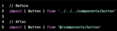
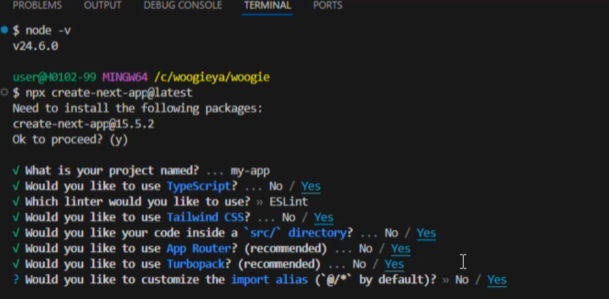
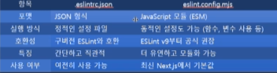
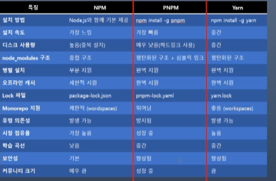
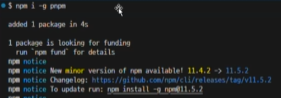
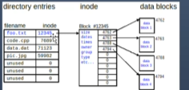

# Next
# 202130414 심민우

## 9월 3일(2주차)

### 수동설치

7. import 및 모듈의 절대 경로 별칭 설정

    - Next.js에는 tsconfig.json 및 jsconfig.json 파일의 "pahts" 및 "baseUrl" 옵션에 대한 지원을 내장하고 있음

    - 

    - 이 옵션을 사용하면 프로젝트 디렉터리를 절대 경롤로 별칭하여 모듈을 더 쉽고 깔끔하게 가져올 수 있음.

#자동 생성되는 항목

강의에서는 프로젝트를 자동으로 생성해서 사용함

다음은 프로젝트를 자동 생성할 때 자동으로 생성되는 항목들임

- package.json 파일에 scripts 자동 추가 / public 디렉토리

- TypeScript 사용 (선택) : tsconfig.json 파일 생성
- Eslint 설정 (선택) : .eslintrc.json 대신 eslint.config.mjs 파일 생성
- Tailwind CSS 사용 (선택)
- src 디렉토리 사용 (선택)
- App Router(선택) : app/layout.tsx 파일 및 app/page.tsx
- Turbopack 사용 (선택)
- import alias 사용 (선택) : tsconfig.json에 "paths" 자동 생성

### Core Web Vitals

- LCP (Largest Contentful Paint) : 뷰포트 내에서 가장 큰 페인트 요소(큰 텍스트 블록, 이미지 또는 비디오)를 표시하는 데 걸리는 시간임  
  - 참고 : 웹페이지 사용자가 바로의 스크롤 동작 없이 볼 수 있는 영역

- FID (First Input Delay) : 사용자가 웹페이지와 상호작용을 시도하는 첫 번째 순간부터 웹페이지가 응답하는 시간임

- CLS (Cumulative Layout Shift) : 방문자에게 콘텐츠가 얼마나 불안정한 지 측정한 값임  
  페이지에서 갑자기 발생하는 레이아웃의 변경이 얼마나 일어나는지를 측정함  
  즉, 레이아웃 이동(layout shift) 빈도를 측정함

### 레이아웃 이동이 발생하는 원인
1. 치수가 없는 이미지

2. 크기가 정의 되지않은 광고, Embeded 및 iframe
3. 동적 콘텐츠

### 실습에 사용할 프로젝트를 생성합니다.

- 공식 문서에는 기본 패키지 관리자를 pnpm을 사용함  

- 원하는 패키지 관리자 탭을 클릭하면 명령을 확인할 수 있음  
- pnpm과 관련한 내용은 뒤에서 설명함  
- 다음 명령으로 프로젝트를 생성함  

`npx create-next-app@latest`

1. 프로젝트 이름을 입력함  

2. TypeScript, ESLint, Tailwind를 사용할지 선택함  
3. src 디렉토리를 사용할지 선택함  
4. App Router를 사용할지 선택함  
5. import alias를 사용할지 선택함  
6. alias 문자를 지정함 (기본은 @/ 임)

- 

### .eslintrc.json vs eslint.config.mjs
- JSON은 주석, 변수, 조건문 등을 쓸 수 없기 때문에 복잡한 설정이 어려움 (JavaScript Object Notation)  

- `mjs`는 ESLint가 새롭게 도입한 방식으로, ESM(ECMAScript 모듈) 형식임  
- 확장자 `.mjs`는 "module JavaScript"를 의미함  
- ESLint v9 이상에서 공식 권장 방식임  
- 조건문, 변수, 동적 로딩 등 코드처럼 유연한 설정이 가능함  
- 다른 설정 파일을 `import` 해서 재사용할 수 있음  
- 프로젝트 규모가 커질수록 유지보수에 유리함
- 

### pnpm
- pnpm은 Performant(효율적인) NPM의 약자로 고성능 Node 패키지 매니저임  

### pnpm
- pnpm은 Performant(효율적인) NPM의 약자로 고성능 Node 패키지 매니저임  

- npm, yarn과 같은 목적의 패키지 관리자이지만, 디스크 공간 낭비, 복잡한 의존성 관리, 느린 설치 속도 문제를 개선을 위해 개발되었음  
- 대표적인 특징은 다음과 같음  
  1. 하드 링크(Hard Link) 기반의 효율적인 저장 공간 사용  
     - 패키지를 한 번만 설치하여 글로벌 저장소에 저장하고, 각 프로젝트의 node_modules 디렉토리에는 설치된 패키지에 대한 하드 링크(또는 심볼릭 링크)가 생성됨  

  2. 빠른 패키지 설치 속도(Performant) : 이미 설치된 패키지는 다시 다운로드하지 않고 재사용하며, 전체 설치뿐만 아니라 종속성 설치 및 업데이트 할 때도 더 빠른 속도를 경험할 수 있음
  3. 엄격하고 효율적인 중복성 관리
  4. 다른 패키지 매니저 대비 비효율성 개선
  - 

### pnpm 설치 및 기본 명령어
- pnpm 글로벌 설치 : $ npm install -g pnpm  

- Node_module 설치(clone 한 경우) : $ pnpm install  
- 새로운 패키지 설치 : $ pnpm add [package]  
- 패키지 제거 : $ pnpm remove [package]  
- 종속성을 최신 버전으로 업데이트 : $ pnpm update  
- 프로젝트에 설치된 모든 패키지를 표시 : $ pnpm list
- 

### Hard link vs. Symbolic link(Soft link)
- pnpm의 특징 중에 하드 링크를 사용해서 디스크 공간을 효율적으로 사용할 수 있다고 함  

- 탐색기에서 npm과 pnpm 프로젝트의 node_module의 용량을 확인해 보세요  
- 왜 효율적이라 한 것일까?  

### 하드 링크(Hard link)
- 우리가 "파일"이라 부르는 것은 두 부분으로 나뉘어 있음  
  1. Directory Entry : 파일 이름과 해당 inode 번호를 매핑 정보가 있는 특수한 파일  

  2. inode : 파일 또는 디렉토리에 대한 모든 메타데이터를 저장하는 구조체  
  - 