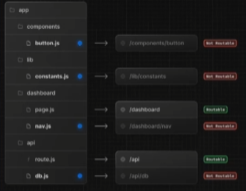
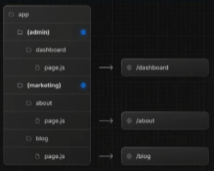

# react-2
# 202130414 심민우

## 9월 17일(4주차)
### git checkout vs git switch 차이
- checkout은 브랜치를 이동하고 파일도 바꿀 수 있음. 이때문에 실수할 위험성이 있음.

- switch는 브랜치만 이동할 수 있기 때문에 안전하게 사용 할 수 있음.

- switch는 이미 작성된 commit을 조작하는 것만 할 수 없는 것이지 나머지 작업, 즉 파일을 작성하고, 수정하고, 커밋하는 것은 가능함.

- 특별한 이유가 없다면 switch를 사용

### 1. Creating a page(페이지 만들기)

- layout은 여러 페이지에서 공유 되는 UI임.

- layout은 네비게이션에서 state 및 상호작용을 유지하며, 다시 렌더링 되지는 않음.
- layout 파일에서 react 컴포넌트의 default export를 사용하여 layout을 정의할 수 있음.
- layout 컴포넌트는 page 또는 다른 layout이 될 수 있는 children prop을 허용해야 함.
- #children은 컴포넌트 안에 감싸진 요소 ( 컴포넌트) 를 의미함.
- 다음 코드에서 <page/>는 <Layout> 컴포넌트의 children임.
- layout 컴포넌트를 만들 때 그 안에 들어갈 콘텐츠(children)을 받을 수 있게 해야 하고 그 컨텐츠는 page 또는 layout 컴포넌트가 될 수 도 있다는 의미

### 3. Creating a nested route (중첩 라우트 만들기)
- 중첩 라우트는 다중 URL 세그먼트로 구성된 라우트임.
- 예를들어,/blog/[slug] 경로는 세 개의 세그먼트로 구성됨.
  - / (Root Segment)
  - blog (Segment)
  - [slug] (lefa Segment)

[ Next.js에서 ]
- 폴더는 URL 세그먼트에 매핑되는 경로 세그먼트를 정의하는데 사용됨.
  - 즉 폴더가 URL 세그먼트가 된다는 의미
- 파일(예:page 및 layout)은 세그먼트에 표시되는 UI를 만드는데 사용됨.
- 폴더를 중첩하면 중첩된 라우트를 만들 수 있음.
- 폴더를 계속 중첩하여 중첩된 경로를 만들 수 있음.
- 예를들어 특정 블로그 게시물에 대한 경로를 만들려면 blog 안에 새 [slug] 폴더를 만들고 page 파일을 추가함.
- 폴더 이름을 대괄호(예:[slug])로 묶으면 데이터에서 여러 페이지를 생성하는데 사용되는 동적 경로 세그먼트가 생성됨. 예 : 블로그 게시물, 제품 페이지 등.

### [slug]의 이해
- const post = posts.find((p) => p.slug === slug);

- posts 배열은 더미 데이터나 DB에서 가져온 결과

- find() 함수는 조건에 맞는 첫 번째 요소 반환  . 못 찾으면 undefined 반환

- -p.slug가 URL에서 온 slug와 일치하는 게시글을 찾아 post에 할당

- find()는 찾는 것이 없으면 undefined 이후 post.title 같은 접근 시 런타임 에러 발생

-  게시글 존재 여부를 확인해야 함

- 데이터 소스가 크다면 .find는 O(n)이므로 DB 쿼리로 바꿔야 함.
:O(n)은 알고리즘의 시간 복잡도가 입력 데이터의 크기 n에 비례하여 시간이나 메모리 사용량이 선형적으로 증가하는 것을 의미함.

- 앞의 코드에서는 Promise 를 사용하지 않아도 오류 없이 동작했음.
- 하지만 params가 동기식처럼 보이지만 사실은 비동기식이라는 것을 좀 더 명확히 하기 위해 사용함.
- 또 한가지 Promise를 명시해주면 await를 깜빡했을때 Typescript가 이를 잡아줌.
- 오류와 상관없이 Promise 사용을 권장함.

- 기본적으로 폴더 계층 구조의 레이아웃도 중첩되어 있음.
- 즉, 자식 prop을 통해 자식 레이아웃을 감싸게 됩니다.
- 특정 경로 세그먼트 안에 레이아웃을 추가하여 레이아웃을 중첩할 수 있음.
- 예를 들어 /blog 경로에 대한 레이아웃을 만들려면 blog 폴더안에 새 레이아웃 파일을 추가함.

### 5.Creating a dynamic Segment 동적 세그먼트 만들기
- 동적 세그먼트를 사용하면 데이터에서 생성된 경로를 만들 수 있음
- 예를 들어 ,각 blog 게시물에 대신, 동적 세그먼트를 만들어 블로그 게시물 데이터를 기반으로 경로를 생성할 수 있음

- 동적 세그먼트를 생성하려면 세그먼트 이름을 대괄호로 묶슴니다.
- 예를 들어, app/blog/[slug]/page.tsx 경로에서 [slug]는 동적 세그먼트임.

- 서버 컴포넌트 page에서는 searchParams prop을 사용하여 검색 매개변수에 엑세스 할 수 있음.

- searchParams를 사용하면 해당 페이지는 동적 렌더링으로 처리됨.
- URL의 쿼리 파라미터를 읽기위해 요청이 필요하기 때문
-클라이언트 컴포넌트는 useSearchParams Hook를 사용하여 검색 매개변수를 읽을 수 있음.
- 정적 렌더링과 동적 렌더링에서 사용가능.

## 9월 10일(3주차)
### 용어 정의

이 장부터 이후에 사용될 몇가지 용어에 대한 설명임.

- 원문에는 route라는 단어가 자주 등장하고, 사전적 의미로는 "경로"임.

- route(라우트)는 "경로"를 의미함. routing(라우팅)은 "경로를 찾아가는 과정"을 의미함.
- 그런데 path도 "경로"로 번역됨. 구분을 위해 대부분 routing(라우팅)으로 번역함.
- directory와 folder는 특별한 구분 없이 나옴.
- 최상위 폴더는 directory로 쓰는 경우 많음. 하위 폴더는 folder로 쓰는 경우 많음. 꼭 그렇지는 않음.
- directory와 folder는 OS에 따라 구분되는 용어임. 같은 의미로 이해하면 됨.
- segment는 routing과 관련 있는 directory의 별칭 정도로 이해하면 됨.

- [최상위 파일 ]Top-level files
  - 최상위 파일은 애플리케이션 구성, 종속성 관리, 미들웨어 실행, 모니터링 도구 통합, 환경변수 정의에 사용됨.
  - 

### 1.Folder and file conventions (폴더 및 파일 규칙)
- [ 동적 라우팅 ]

- [ 라우팅 그룹 및 비공개 폴더 ] 
- [ 병렬 및 차단 라우팅 ]

### Open Graph Protocol

- 웹사이트나 페이스북, 인스타그램, X(트위터), 카카오톡 등에 링크를 전달할 때 ‘미리보기’를 생성하는 프로토콜임.

- Open Graph Protocol이 대표적인 프로토콜임.
- 페이스북이 주도하는 표준화 규칙으로 대부분의 SNS 플랫폼에서 활용되고 있음.
- 모든 플랫폼이 동일한 방식으로 오픈 그래프를 처리하는 것은 아님.
- 웹페이지의 메타 태그에 선언함.
- 

### layout과 template의 차이
- 

### 2.Orgnaizing your project 프로젝트 구성하기

- component는 중첩된 라우팅에서 재귀적으로 렌더링 됨.

- 즉 , 라우팅 세그먼트의 component는 부모 세그먼트의 component 내부에 중첩됨.
- 

- [ 코로케이션 ] colocation - 파일 및 폴더를 기능별로 그룹화하여 프로젝트의 구조를 명확하게 정의.
  - app 디렉토리에서 중첩된 폴더는 라우팅 구조를 정의함.
  
  - 각 폴더는 URL 경로의 해당 세그먼트에 맵핑되는 라우팅 세그먼트를 나타냄.
  - 

- 즉, 프로젝트 파일을 app 디렉토리의 라우팅 세그먼트 내에 안전하게 배치하여 실수로 라우팅 되지 않도록 할 수 있음
  - 
- 원한다면 프로젝트 파일을 app 디렉토리 외부에 보관할 수도 있음.

- [ 라우팅 그룹 ] Route Groups
    - 폴더를 괄호로 묶어 라우팅 그룹을 만들 수 있음
    - 이 것은 해당 폴더가 구성 목적으로 사용되는 것을 의미하며, 라우터의 URL 경로에 포함되지 않아야 합니다.
    - 

- 라우팅 그룹은 다음과 같은 경우에 유용함.

- 사이트 섹션, 목적 또는 팀별로 라우트를 구성함.
- 예: 마케팅 페이지, 관리 페이지 등.
- 동일한 라우팅 세그먼트 수준에서 중첩 레이아웃 활성화:
  - 공통 세그먼트 안에 여러 개의 루트 레이아웃을 포함하여 여러 개의 중첩 레이아웃 만들기
  - 공통 세그먼트의 라우팅 하위 그룹에 레이아웃 추가
  - 

- [src 디렉토리]
  - Next.js는 애플리케이션 코드(app 포함)를 옵션으로 선택하여 src 폴더 내에 저장할 수 있도록 지원함.

  - 이를 통해 애플리케이션 코드와 주로 프로젝트 루트에 위치하는 프로젝트 설정 파일을 분리할 수 있음.

### 3-3. Split project files by feature or route  
기능 또는 라우팅 별로 프로젝트 파일 분할

- 이 전략은 전역적으로 공유되는 애플리케이션 코드를 app 디렉토리 루트에 저장하고, 보다 구체적인 애플리케이션 코드는 이를 사용하는 라우팅 세그먼트로 분할함.

- 문서에서는 방법을 설명하는 것이고, 우리는 src/를 사용하기 때문에 라우팅 페이지를 제외한 프로젝트 코드는 src/에서 관리함.

### directing (내가 메모하려고 만듬)

- about 일반 폴더
- (marketting) 그룹화하려고 만든폴더. 경로에서 무시함.

### 3-6. Opting for loading skeletons on a specific route  
특정 라우트에 스켈레톤 로딩을 적용하도록 선택

- loading.js 파일을 통해 특정 라우트 폴더에 로딩 스켈레톤을 적용하면, 새 라우팅 그룹(예: /overview)을 만든 다음 해당 라우팅 그룹 내부로 loading.tsx를 이동함.

- 이제 해당 loading.tsx 파일은 dashboard 페이지에만 적용됨.  
  → URL 경로 구조에 영향을 주지 않고 모든 dashboard 페이지 대신 overview 페이지로 이동됨.

- loading skeletons (스켈레톤 로딩)  
  - 콘텐츠가 로드되기 전, 마치 뼈대(skeleton)처럼 실제 콘텐츠가 표시될 위치에 회색이나 반투명한 상자 또는 영역을 표시하여, 사용자에게 로딩 중임을 시각적으로 안내하고, 로딩 완료 후의 화면 구성을 미리 짐작할 수 있도록 도와주는 역할을 하는 임시의 안내 프레임임.

## 9월 3일(2주차)

### 수동설치

7. import 및 모듈의 절대 경로 별칭 설정

    - Next.js에는 tsconfig.json 및 jsconfig.json 파일의 "pahts" 및 "baseUrl" 옵션에 대한 지원을 내장하고 있음

    - 

    - 이 옵션을 사용하면 프로젝트 디렉터리를 절대 경롤로 별칭하여 모듈을 더 쉽고 깔끔하게 가져올 수 있음.

#자동 생성되는 항목

강의에서는 프로젝트를 자동으로 생성해서 사용함

다음은 프로젝트를 자동 생성할 때 자동으로 생성되는 항목들임

- package.json 파일에 scripts 자동 추가 / public 디렉토리

- TypeScript 사용 (선택) : tsconfig.json 파일 생성
- Eslint 설정 (선택) : .eslintrc.json 대신 eslint.config.mjs 파일 생성
- Tailwind CSS 사용 (선택)
- src 디렉토리 사용 (선택)
- App Router(선택) : app/layout.tsx 파일 및 app/page.tsx
- Turbopack 사용 (선택)
- import alias 사용 (선택) : tsconfig.json에 "paths" 자동 생성

### Core Web Vitals

- LCP (Largest Contentful Paint) : 뷰포트 내에서 가장 큰 페인트 요소(큰 텍스트 블록, 이미지 또는 비디오)를 표시하는 데 걸리는 시간임  
  - 참고 : 웹페이지 사용자가 바로의 스크롤 동작 없이 볼 수 있는 영역

- FID (First Input Delay) : 사용자가 웹페이지와 상호작용을 시도하는 첫 번째 순간부터 웹페이지가 응답하는 시간임

- CLS (Cumulative Layout Shift) : 방문자에게 콘텐츠가 얼마나 불안정한 지 측정한 값임  
  페이지에서 갑자기 발생하는 레이아웃의 변경이 얼마나 일어나는지를 측정함  
  즉, 레이아웃 이동(layout shift) 빈도를 측정함

### 레이아웃 이동이 발생하는 원인
1. 치수가 없는 이미지

2. 크기가 정의 되지않은 광고, Embeded 및 iframe
3. 동적 콘텐츠

### 실습에 사용할 프로젝트를 생성합니다.

- 공식 문서에는 기본 패키지 관리자를 pnpm을 사용함  

- 원하는 패키지 관리자 탭을 클릭하면 명령을 확인할 수 있음  
- pnpm과 관련한 내용은 뒤에서 설명함  
- 다음 명령으로 프로젝트를 생성함  

`npx create-next-app@latest`

1. 프로젝트 이름을 입력함  

2. TypeScript, ESLint, Tailwind를 사용할지 선택함  
3. src 디렉토리를 사용할지 선택함  
4. App Router를 사용할지 선택함  
5. import alias를 사용할지 선택함  
6. alias 문자를 지정함 (기본은 @/ 임)

- 

### .eslintrc.json vs eslint.config.mjs
- JSON은 주석, 변수, 조건문 등을 쓸 수 없기 때문에 복잡한 설정이 어려움 (JavaScript Object Notation)  

- `mjs`는 ESLint가 새롭게 도입한 방식으로, ESM(ECMAScript 모듈) 형식임  
- 확장자 `.mjs`는 "module JavaScript"를 의미함  
- ESLint v9 이상에서 공식 권장 방식임  
- 조건문, 변수, 동적 로딩 등 코드처럼 유연한 설정이 가능함  
- 다른 설정 파일을 `import` 해서 재사용할 수 있음  
- 프로젝트 규모가 커질수록 유지보수에 유리함
- 

### pnpm
- pnpm은 Performant(효율적인) NPM의 약자로 고성능 Node 패키지 매니저임  

### pnpm
- pnpm은 Performant(효율적인) NPM의 약자로 고성능 Node 패키지 매니저임  

- npm, yarn과 같은 목적의 패키지 관리자이지만, 디스크 공간 낭비, 복잡한 의존성 관리, 느린 설치 속도 문제를 개선을 위해 개발되었음  
- 대표적인 특징은 다음과 같음  
  1. 하드 링크(Hard Link) 기반의 효율적인 저장 공간 사용  
     - 패키지를 한 번만 설치하여 글로벌 저장소에 저장하고, 각 프로젝트의 node_modules 디렉토리에는 설치된 패키지에 대한 하드 링크(또는 심볼릭 링크)가 생성됨  

  2. 빠른 패키지 설치 속도(Performant) : 이미 설치된 패키지는 다시 다운로드하지 않고 재사용하며, 전체 설치뿐만 아니라 종속성 설치 및 업데이트 할 때도 더 빠른 속도를 경험할 수 있음
  3. 엄격하고 효율적인 중복성 관리
  4. 다른 패키지 매니저 대비 비효율성 개선
  - 

### pnpm 설치 및 기본 명령어
- pnpm 글로벌 설치 : $ npm install -g pnpm  

- Node_module 설치(clone 한 경우) : $ pnpm install  
- 새로운 패키지 설치 : $ pnpm add [package]  
- 패키지 제거 : $ pnpm remove [package]  
- 종속성을 최신 버전으로 업데이트 : $ pnpm update  
- 프로젝트에 설치된 모든 패키지를 표시 : $ pnpm list
- 

### Hard link vs. Symbolic link(Soft link)
- pnpm의 특징 중에 하드 링크를 사용해서 디스크 공간을 효율적으로 사용할 수 있다고 함  

- 탐색기에서 npm과 pnpm 프로젝트의 node_module의 용량을 확인해 보세요  
- 왜 효율적이라 한 것일까?  

### 하드 링크(Hard link)
- 우리가 "파일"이라 부르는 것은 두 부분으로 나뉘어 있음  
  1. Directory Entry : 파일 이름과 해당 inode 번호를 매핑 정보가 있는 특수한 파일  

  2. inode : 파일 또는 디렉토리에 대한 모든 메타데이터를 저장하는 구조체  
  - 

